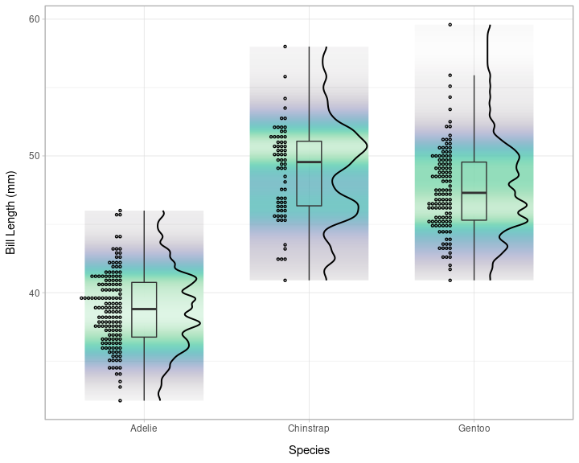
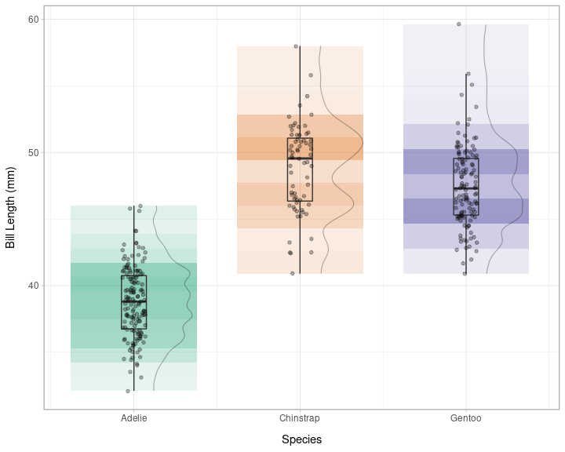

elevator rug box plot thing…
================

``` r
#load packages
library(palmerpenguins)
library(ggplot2)
library(dplyr)
library(tidyr)
library(ggdist)
#load functions
```

This is the correct way to do this using ggdist

``` r
penguins %>%
  ggplot(aes(x = species, y = bill_length_mm, fill = species)) +
  stat_gradientinterval(position = "dodge", colour=NA, width=0.9) +
  theme_light()+
  labs(x='Species', y='Bill Length (mm)') +
  guides(fill="none", alpha='none')+
  theme(axis.title.y = element_text(margin = margin(t = 0, r = 10, b = 0, l = 0)),
        axis.title.x = element_text(margin = margin(t = 10, r = 0, b = 0, l = 0)))+
  scale_fill_brewer(palette = 'Dark2') +
  ggdist::stat_halfeye(adjust = .3, width = .3, .width = 0, justification = -.3,
                       point_colour = 'NA', slab_fill=NA, slab_colour='black',
                       slab_size=0.4) +
  geom_boxplot(width = .15, outlier.shape = NA, fill=NA) +
  ggdist::stat_dots(
    side = "left",
    dotsize = .8,
    justification = 1.15,
    binwidth = .3,
    colour='black'
  ) +
  coord_cartesian(xlim = c(1, NA), clip = "off")
```

<!-- -->

Another just for fun …

``` r
penguins %>%
  ggplot(aes(x = species, y = bill_length_mm, fill = species)) +
  stat_gradientinterval(aes(fill=stat(pdf)),position = "dodge", colour=NA, 
                        width=0.8, slab_type='pdf', fill_type = "gradient") +
  scale_fill_gradientn(colours=viridisLite::mako(255))+
  theme_light()+
  labs(x='Species', y='Bill Length (mm)') +
  guides(fill="none", alpha='none')+
  theme(axis.title.y = element_text(margin = margin(t = 0, r = 10, b = 0, l = 0)),
        axis.title.x = element_text(margin = margin(t = 10, r = 0, b = 0, l = 0)))+
  ggdist::stat_halfeye(adjust = .3, width = .3, .width = 0, justification = -.3,
                       point_colour = 'NA', slab_fill=NA, slab_colour='black',
                       slab_size=0.7, fill=NA) +
  geom_boxplot(width = .15, outlier.shape = NA, fill=NA) +
  ggdist::stat_dots(
    side = "left",
    dotsize = .8,
    justification = 1.15,
    binwidth = .3,
    colour='black',
    fill=NA) +
  coord_cartesian(xlim = c(1, NA), clip = "off")
```

<!-- -->

Here’s my original approach which works okay but don’t bother - just use
{ggdist}!

``` r
#load functions
source('barcodeBoxPlot.R')
# make the plot
barcodeBoxPlot(penguins, species, bill_length_mm,
                    .gapnudge=.38, .alpharange=c(0.1,.7)) +
  theme_light()+
  labs(x='Species', y='Bill Length (mm)') +
  guides(fill="none", alpha='none')+
  theme(axis.title.y = element_text(margin = margin(t = 0, r = 10, b = 0, l = 0)),
        axis.title.x = element_text(margin = margin(t = 10, r = 0, b = 0, l = 0)))+
  scale_fill_brewer(palette = 'Dark2')+
  ggdist::stat_halfeye(adjust = .5, width = .3, .width = 0, justification = -.4,
    point_colour = 'NA', slab_fill=NA, slab_colour='black', slab_alpha = .3,
    slab_size=0.4) +
  geom_boxplot(width = .15, outlier.shape = NA, fill=NA) +
  geom_point(size = 1.3, alpha=0.3, position = position_jitter(
    seed = 1, width = .07)) +
  coord_cartesian(xlim = c(0.6, NA), clip = "off")
```

<!-- -->
